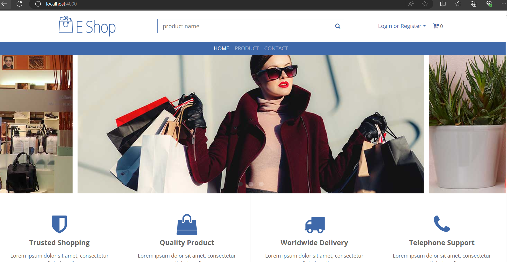

# Phát triển ứng dụng WEB-SHOPPING

**Chủ đề**

- Ứng dụng mua sắm

**Các tính năng nổi bật**

- Forgot-password

- Authentication

- Tìm kiểm sản phẩm (theo keyword, tag, category, giá, ngày)

- Xác nhận mua hàng (gửi email xác nhận)

**Công nghệ sử dụng**

- Golang

- HTML, CSS

- JWT

- MariaDB

**Cách cài đặt**

- Cài đặt package go

```bash
go get
```

```bash
go mod tidy
```

```bash
go install ./...
```

- Khởi tạo database

```bash
soda migrate up
```

**Hình ảnh của WEB-SHOPPING**

- Giao diện trang chủ
  

- chức năng thêm sản phẩm
  

- chức năng xem giỏ hàng
  

- chức năng xem thông tin đơn hàng
  
